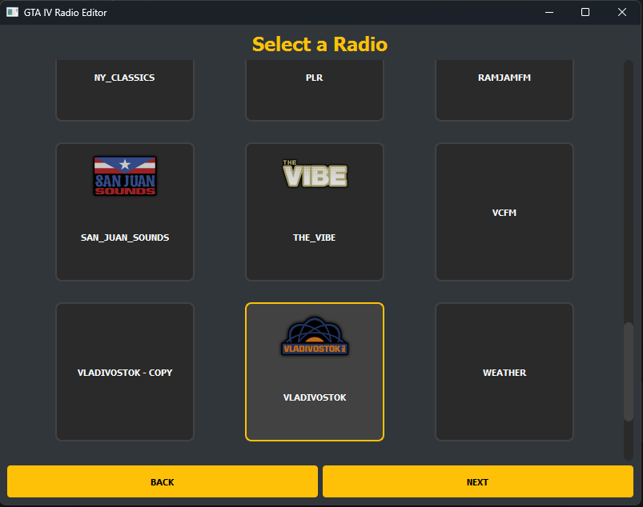
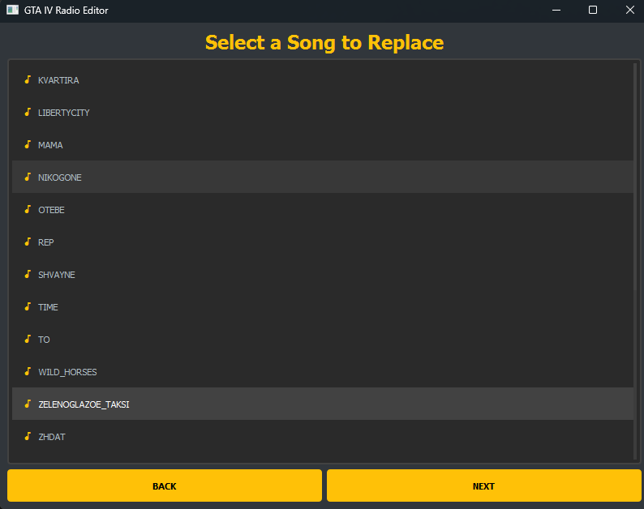

# IV Radio Editor

A desktop application that allows you to customize the radio experience in Grand Theft Auto IV by replacing songs while maintaining the game's audio format and integrity.

<div style="display: flex; justify-content: space-between; margin: 20px 0;">
    
    
</div>

## ⚠️ Important Notes

- **Game Version Compatibility**:
  - This tool is compatible with GTA IV version 1.0.8.0. If you own a legitimate copy of another version, you may temporarily use a backup of the 1.0.8.0 executable in your game directory for compatibility purposes. Users must own a legitimate copy of the game to use this tool.
  - Not tested with Episodes from Liberty City (EFLC) - likely won't work
- **File Modifications**: This tool modifies:
  - Radio .rpf files in `\pc\audio\sfx`
  - `\pc\audio\config\sounds.dat15` for correct timestamping
  - **It is strongly recommended to backup these files before using the tool**
- **Disclaimer**: The creator is not responsible for any issues that may arise from the use of this application

## Features

- **User-friendly Interface**: Modern, dark-themed GUI built with PySide6
- **Step-by-step Workflow**: Guided process for replacing songs
- **Radio Station Support**: Aims to be compatible with all GTA IV radio stations
- **Audio Processing**: Automatically handles audio format conversion
- **Metadata Updates**: Updates song length and metadata in game files

## Dependencies

- PySide6: Modern Qt-based GUI framework
- pydub: Audio processing library
- pyrpfiv: RPF file format parser for GTA IV (Currently unreleased - will be available on PyPI soon)
- qt_material: Material design styling

## Project Structure

```
├── app.py                  # Main application entry point
├── ui/                     # User interface components
│   ├── main_window.py     # Main application window
│   ├── pages/             # Individual page implementations
│   │   ├── intro.py       # Game directory selection
│   │   ├── radio_select.py# Radio station selection
│   │   ├── song_select.py # Song selection
│   │   ├── replace.py     # New song selection
│   │   └── progress.py    # Progress tracking
│   ├── signals.py         # Qt signals
│   ├── styles.py          # UI styling
│   └── widgets.py         # Custom widgets
├── replace_audio/         # Audio replacement functionality
│   ├── replace_audio.py   # Audio conversion logic
│   └── *.dll             # Required audio processing libraries
├── update_length/         # Song length updating
│   └── update_song_length.py  # Length modification logic
└── assets/               # Application assets
    ├── fonts/           # Custom fonts
    └── radio/           # Radio station images
```

## How It Works

The application provides a simple workflow:

1. Select your GTA IV installation directory
2. Choose a radio station
3. Select the song you want to replace
4. Choose your new song file
5. Wait for the process to complete

## Requirements

- Grand Theft Auto IV (version 1.0.8.0)
- Python 3.6 or higher
- Required Python packages (see dependencies)
- pyrpfiv library (upcoming release)

## File Format Support

The application handles audio conversion automatically, but for best results, input audio files should be:

- High quality (at least 192kbps)
- Stereo audio
- Common formats (MP3, WAV, etc.)

## Contributing

Support in maintaining and updating this tool is appreciated, especially for:

- Testing and adding support for Episodes from Liberty City (EFLC)
- Improving compatibility with different game versions
- Bug fixes and feature enhancements

## Acknowledgments

This project utilizes several third-party tools and libraries:

### RAGE Audio Toolkit + Audio Editor

- Created by [AndrewMulti](https://github.com/AndrewMulti)
- Repository: [RAGE-Audio-Toolkit](https://github.com/AndrewMulti/RAGE-Audio-Toolkit/tree/main)
- Used for audio file processing and conversion

### BASS Audio Library

- Developed by [Un4seen Developments](https://www.un4seen.com/)
- Components used:
  - BASS: Core audio library
  - BASSmix: Audio mixing functionality
  - BASSenc: Audio encoding capabilities

### IV Audio Editor (ivam.exe)

- Created by [AndrewMulti](https://github.com/AndrewMulti)
- Used for metadata editing
- Handles conversion of sounds.dat15 to JSON and back
- Integrated with update_song_length.py for metadata updates

### GTA Forums Community

- Special thanks to [MeshugaPalejo](https://gtaforums.com/profile/1170841-meshugapalejo/) for their comprehensive [guide on replacing radio songs](https://gtaforums.com/topic/977470-guide-to-replacing-songs-on-existing-radio-stations/)

This tool automates the manual processes described in the guide

## Disclaimer

This project includes radio station logos from _Grand Theft Auto IV_, originally created by Rockstar Games. These logos are provided for identification and visual purposes only.

The logos were sourced from [HQ Radio Icons 1.2 by Sborges98](https://www.gtainside.com/en/gta4/mods/107596-hq-radio-icons-1-2) and are used under the belief that their inclusion qualifies as **fair use** under copyright law. Specifically:

- The logos are presented in a non-commercial, fan-made project.
- Their use is limited to aiding users in identifying radio stations within the game.
- This project does not include any other proprietary game assets or facilitate piracy.
- This project does not facilitate piracy, circumvent DRM protections, or include any copyrighted game files, aside from third-party assets used under the belief of fair use.

If you are the copyright holder and have concerns about this use, please contact me, and I will address the issue promptly.

## Notes

- Always backup your game files before making modifications
- Ensure you have proper permissions to modify game files
- Compatible only with GTA IV version 1.0.8.0
- The pyrpfiv library is required but currently unreleased - stay tuned for its PyPI release

## License

This project is licensed under the MIT License.

You are free to use, modify, and distribute this software, provided that proper attribution is given to the original author. This software is provided "as is," without warranty of any kind, express or implied, including but not limited to the warranties of merchantability, fitness for a particular purpose, and noninfringement.

See the [LICENSE](LICENSE) file for the full license text.
